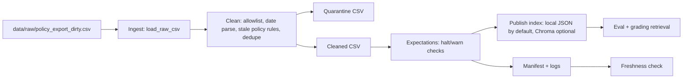

# Kiến Trúc Pipeline - Lab Day 10

**Nhóm:** Day10 data pipeline group  
**Cập nhật:** 2026-06-10  
**Run cuối:** `final-pass`

## 1. Sơ Đồ Luồng

`run_id` được ghi ở log, manifest, cleaned CSV, quarantine CSV và metadata publish. Freshness được đo sau publish bằng `latest_exported_at` trong manifest.

## 2. Ranh Giới Trách Nhiệm

| Thành phần | Input | Output | Owner nhóm |
|---|---|---|---|
| Ingest | `data/raw/policy_export_dirty.csv` | 247 raw rows | Ingestion Owner |
| Transform | raw rows | 37 cleaned rows, 210 quarantine rows | Cleaning & Quality Owner |
| Quality | cleaned rows | expectation results, halt/warn decision | Cleaning & Quality Owner |
| Embed/Publish | cleaned CSV | `artifacts/local_index/day10_kb.json` | Embed Owner |
| Monitor | manifest | freshness PASS/WARN/FAIL | Monitoring Owner |

## 3. Idempotency & Rerun

Pipeline dùng `chunk_id` ổn định từ `doc_id`, nội dung đã clean và sequence. Backend publish mặc định ghi snapshot local JSON theo collection (`day10_kb.json`), nên rerun thay thế index hiện tại thay vì phình thêm vector cũ. Nếu đặt `DAY10_EMBED_BACKEND=chroma`, code vẫn giữ chiến lược upsert theo `chunk_id` và prune id không còn trong cleaned snapshot.

## 4. Liên Hệ Day 09

Day 09 agent phụ thuộc retrieval đúng version. Day 10 tách riêng collection/index `day10_kb` để chứng minh tầng dữ liệu trước khi agent đọc: refund phải là 7 ngày, HR phải là bản 2026, và access-control phải được allowlist. Sau khi pipeline pass, index này có thể thay corpus retrieval của Day 09 hoặc dùng làm snapshot kiểm thử trước khi agent orchestration chạy.

## 5. Rủi Ro Đã Biết

- `latest_exported_at=2026-04-11T00:00:00` nên freshness FAIL với SLA 24h trong ngày chạy 2026-06-10.
- Local lexical backend được dùng mặc định để lab chạy ổn định khi `chromadb` hoặc model embedding chưa cài; Chroma vẫn là backend tùy chọn.
- Raw CSV còn nhiều nguồn ngoài phạm vi grading (`data_privacy_guideline`, `security_policy`, `legacy_catalog_xyz_zzz`) nên hiện bị quarantine theo contract.
